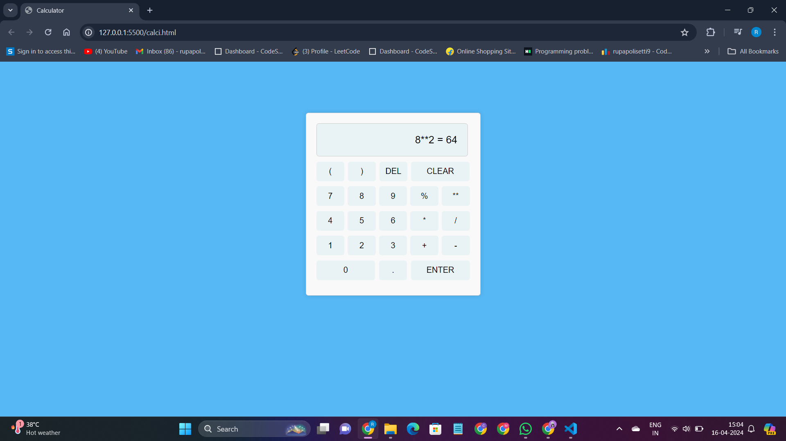
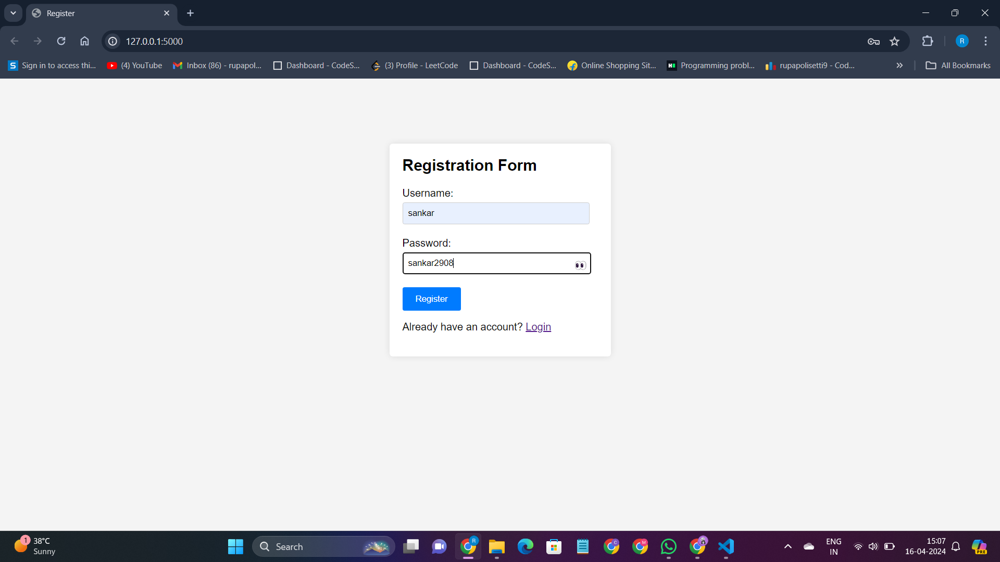
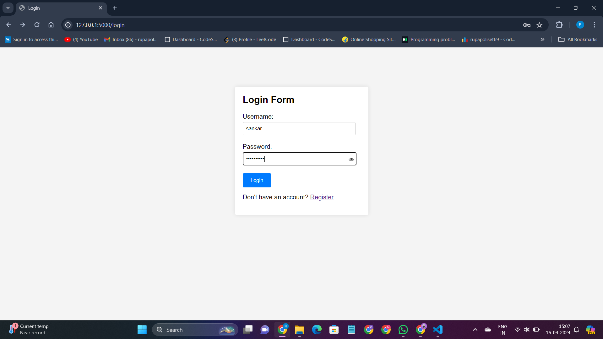

# OIBSIP (OASIS Infobyte - Web Development and Designing Internship Projects)

## Description
Welcome to the OIBSIP repository! This repository houses the projects completed as part of the OASIS Infobyte Web Development and Designing Internship Program. Here, you'll find a showcase of skills in web development and design through various tasks undertaken during the internship.

## Tasks

*1. Calculator:*
   - A simple calculator web application built using HTML, CSS, and JavaScript.
   - Performs basic arithmetic operations like addition, subtraction, multiplication, and division.
   - 

*2. Tribute Page to Pawan Kalyan:*
   - A tribute page dedicated to the renowned actor and politician, Pawan Kalyan.
   - Designed with HTML and CSS, providing information about his life, achievements, and contributions.
   - 

*3. Todo Web App:*
   - A todo list web application developed using HTML, CSS, and JavaScript.
   - Allows users to add, delete, and mark tasks as completed.
   - 

*4. Login Authentication System:*
   - Implementation of a login authentication system using HTML, CSS for frontend, and Python for backend.
   - The system consists of:
     - *Registration Page:* Allows users to create an account with a username and password. Passwords are securely hashed using the bcrypt library.
     - *Login Page:* Allows registered users to log in securely.
     - *Secured Page:* Once logged in, users are directed to a secured page.
   - Tech Stack: HTML, CSS, Python
   - Libraries: Bcrypt for password hashing
   - 
   - 

